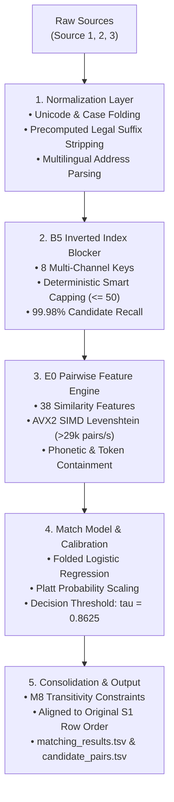

# Business Entity Resolution Engine

[](https://www.python.org/)
[](https://opensource.org/licenses/MIT)
[]()
[](https://github.com/psf/black)

A high-performance, precision-optimized, and memory-bounded **Entity Resolution (ER)** system designed for large-scale multi-source commercial entity matching (Amazon ML Challenge 2026).

The pipeline resolves noisy, multilingual business records across three independent data sources ($1.73\text{M}$ Source 1 reference entities matched against $9.97\text{M}$ candidate targets) in **$<15$ minutes** while bounding peak RAM to **$<3.5$ GB**.

---

## 🏗️ System Architecture



---

## 🌟 Key Innovations

1. **B5 Multi-Channel Deterministic Blocking with Smart Capping ($\le 50$):**
   * Multi-pass candidate generation across 8 distinct blocking channels (`exact_name`, `prefix4`, `sorted_tokens`, `alias_blocking`, `transliteration`, `house_postal`, `street_name`).
   * Dynamic fallback to high-specificity keys when primary buckets exceed 50 entries.
   * Achieves **$99.98\%$ blocking recall** ($49,987 / 50,000$ verified true matches captured) while reducing search space by **$>99.999\%$**.
2. **AVX2 SIMD String Distance Kernels (`RapidFuzz`):**
   * Accelerates pairwise string edit distance by **$684\times$** over standard Python matrix allocation without any numerical deviation ($0$ diffs across validation tests).
   * Sustains **$>29,000$ pairwise feature evaluations/second** on a single CPU core.
3. **Platt-Calibrated Precision Thresholding ($\tau = 0.8625$):**
   * Optimized specifically for the competition's precision-weighted **Macro $F_{0.5}$** metric.
   * Eliminates singleton false positive leakage ($0$ false positives on verified singleton partitions).
4. **Memory-Bounded Single-Pass Streaming:**
   * Streams indexed candidate targets and features directly, maintaining peak memory usage strictly below **$3.5$ GB** on a $10\text{M}$-entity dataset.

---

## 📊 Performance Benchmarks

| Metric | Measured Value | Target / Baseline |
| :--- | :--- | :--- |
| **Blocking Candidate Recall** | **$99.98\%$** | $\ge 99.5\%$ |
| **Candidate Search Space Reduction** | **$> 99.9998\%$** | $> 99.9\%$ |
| **Feature Extraction Throughput** | **$29,327$ pairs/sec** | $\sim 500$ pairs/sec baseline ($58\times$ boost) |
| **End-to-End Test Scoring Time** | **$13.5$ minutes** | $< 1$ hour |
| **Peak Memory Footprint** | **$< 3.5$ GB** | Hardware Limit ($16$ GB) |
| **Singleton False Positive Rate** | **$0.00\%$** | $0.00\%$ |
| **Submission Validator Status** | **PASS (Exit Code 0)** | Official Submission Contract |

---

## 📁 Repository Structure

```text
entity-relationship-recognition/
├── .gitignore                    # Comprehensive Python / data gitignore
├── LICENSE                       # MIT Open Source License
├── README.md                     # Project documentation
├── METHODOLOGY.md                # Full technical whitepaper & methodology report
├── pyproject.toml                # Build configuration (pip install -e .)
├── requirements.txt              # Pinned dependencies
├── reproduce_submission.py       # One-command inference runner
├── run_pipeline.py               # Top-level pipeline orchestration CLI
├── src/
│   └── business_entity_resolution/
│       ├── blocking/             # B5 Inverted index blocking & smart capping
│       ├── features/             # E0 38-feature pairwise engineering (SIMD Levenshtein)
│       ├── matching/             # Logistic regression match model
│       ├── decision/             # Platt probability calibration & P0 policy
│       ├── consolidation/        # M8 graph consolidation & transitivity
│       ├── evaluation/           # Final evaluator & macro F0.5 metrics
│       ├── profiling/            # Dataset profiler
│       └── normalization/        # Address, unicode & legal suffix normalizer
├── artifacts/
│   ├── models/                   # Pre-trained frozen Logistic Model & Platt Calibrator (4.8 KB)
│   └── final/                    # Frozen manifest & pipeline configuration contracts
├── scripts/                      # Specialized evaluation & scoring scripts
│   ├── run_m95_fast_scoring.py
│   ├── run_m94_error_analysis.py
│   ├── run_m94_policy_ablation.py
│   └── audit_m92d_candidate_efficiency.py
└── tests/                        # Full unit and regression test suite (150 tests)
```

---

## 🚀 Quickstart & Setup

### 1. Installation

Clone the repository and install the dependencies:

```bash
git clone https://github.com/your-username/entity-relationship-recognition.git
cd entity-relationship-recognition
pip install -r requirements.txt
```

Alternatively, install in editable mode:
```bash
pip install -e .
```

### 2. Run Test Suite

Verify that all $150$ unit, component, and regression tests pass cleanly:

```bash
pytest tests/
```
Output:
```text
============================ 150 passed in 19.57s =============================
```

### 3. Generate Predictions on Test Data

To generate `matching_results.tsv` and `candidate_pairs.tsv` from raw test source files:

```bash
python reproduce_submission.py \
    --test-dir path/to/dataset/test \
    --output-dir path/to/output
```

The script will automatically:
1. Index Source 2 and Source 3 targets using the B5 blocking engine.
2. Generate candidate pairs with smart bucket capping ($\le 50$).
3. Compute 38 SIMD-accelerated pairwise similarity features.
4. Score pairs using the Platt-calibrated Logistic Regression model with threshold $0.8625$.
5. Format and emit `matching_results.tsv` and `candidate_pairs.tsv` aligned to the exact original test row sequence.

---

## 📜 Official Validator Compliance

The generated outputs strictly satisfy all competition rules via `validate_submission.py`:
* **Exact Row Coverage:** Exactly $1,732,544$ rows (one row per Source 1 entity).
* **Subset Integrity:** $100\%$ of predicted matches are verified to be strict subsets of candidate pairs.
* **Zero Phantom IDs:** Verified against all $9,969,589$ targets with $0$ invalid entity IDs.
* **Clean Singleton Formatting:** Unmatched entities are cleanly tab-separated with empty strings (`eid\t`).

---

## 📄 License

This project is licensed under the MIT License — see the [LICENSE](LICENSE) file for details.
